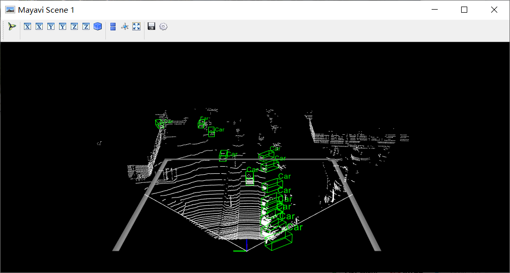
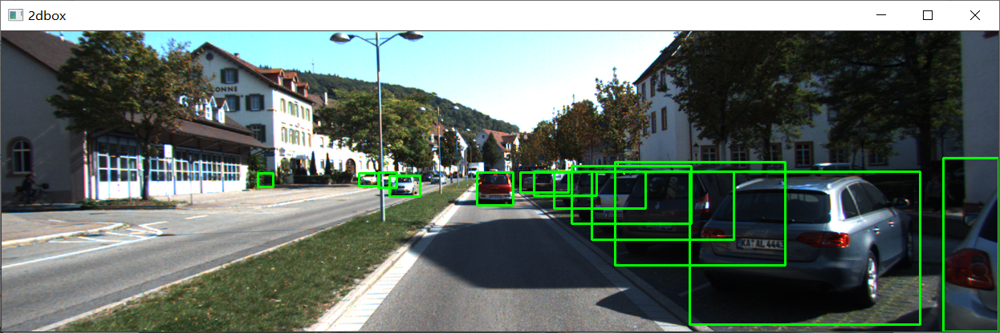
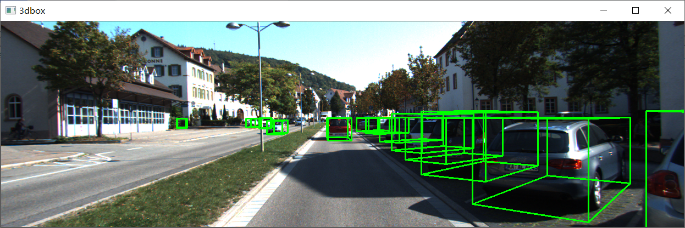
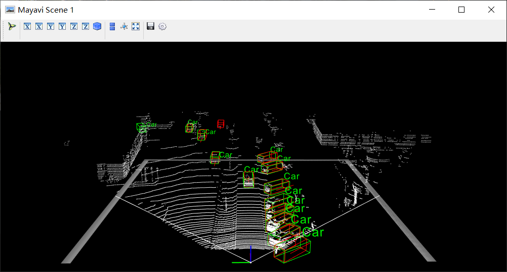

#### Introduction

This project is to provide a 3D point cloud data-based vehicle detection method for OpenCV. The original model used in this project is the [Point-based 3D Single Stage Object Detector](https://arxiv.org/abs/2002.10187) (3DSSD) model. .

Model inference accuracy: 3DSSD model validation results on KITTI dataset (3,769 test samples) achieved **91.71% (easy), 80.44% (hard)**

| Easy AP | Moderate AP | Hard AP |
| :-----: | :---------: | :-----: |
|  91.71  |    83.30    |  80.44  |

At present, we have obtained two models adapted to opencv 4.5.1 based on the original model, and the predicted results are identical to those of the original model with the same inputs.

#### Catalog Structure

```
.
|--Model
	|--3dssd-4096.pb
	|--3dssd-2048.pb
|--src
	|--data
	|--core
	|--opencvCustomOps
	|--vis
|--data
	|--calib                         (Calibration files)
	|--image
	|--point
	|--pre_data                      (Pre-processed files)
	|--aft_data                      (Model inference results)
	|--label                         (Label and results that can be visualized)
	|--pred                          (ground_truth)
	|--list.txt
```

#### Environmental requirements

* Python 3.7
* OpenCV 4.5.1
* g++ 5.4

#### Installation

(1) Install OpenCV4.5.1

(2) Clone this repository.

```
git clone https://gitee.com/openeuler2020/team-1878343640.git
cd team-1878343640
```

(3) Setup Python environment.

```
conda create -n 3dssd python=3.7
source activate 3dssd
pip install -r requirements_linux.txt
```

(4) Compile and install 3DSSD library.

```
bash compile.sh
```

#### Inference & Visualization

(1) Data pre-processing

```
python src/data/data_preprocessor.py
```

(2) Model Reasoning

```
./src/core/main 0
```

or modify the parameter to 1 to use faster model inference

```
./src/core/main 1 
```

(3) Post-processing of the results into 3D and 2D boxes in the data/label folder for visualization

```
python src/data/result_processor.py
```

(4) Run src/vis/show.py for visualization, run with the parameters ind (index of picture)

```
python src/vis/show.py --ind 5012
```

Adding the -p parameter allows comparison with the ground truth

```
python src/vis/show.py --ind 5012 -p
```

Sample visualization results：










##### References

[1] Yang Z ,  Sun Y ,  Liu S , et al. 3DSSD: Point-based 3D Single Stage Object Detector[J]. 2020 IEEE/CVF Conference on Computer Vision and Pattern Recognition (CVPR), 2020.
